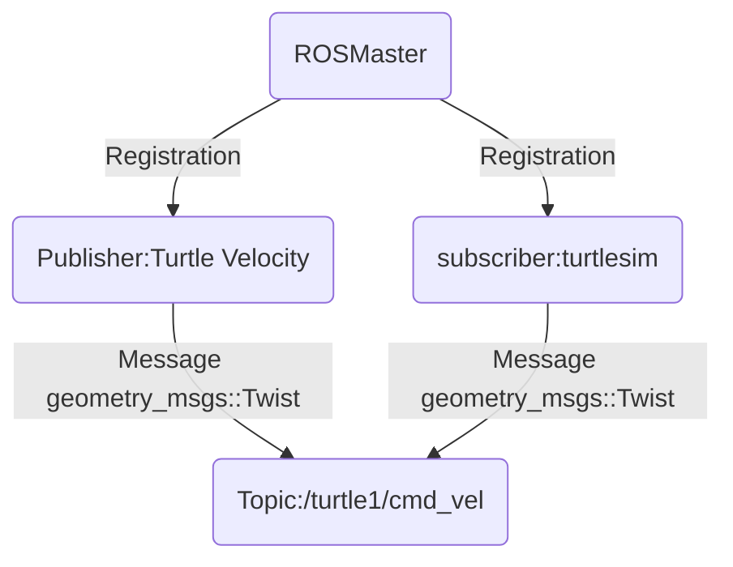
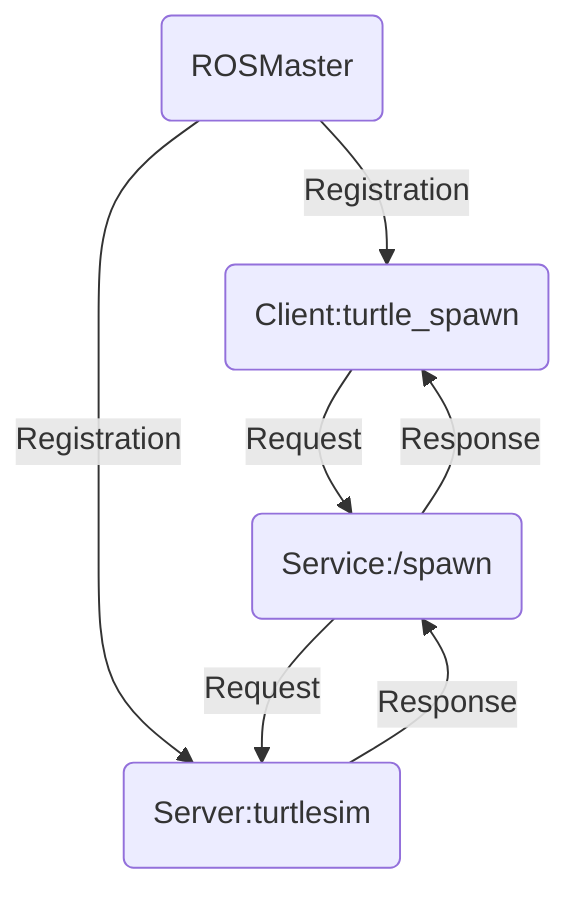
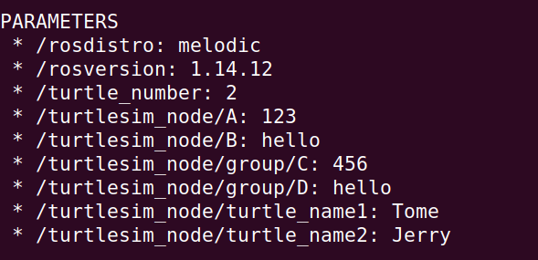
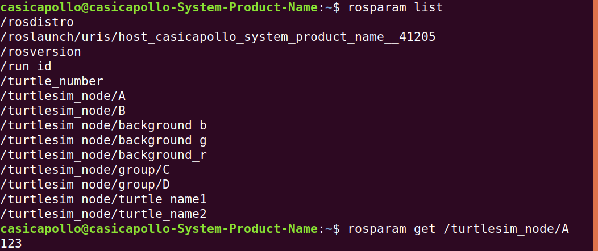

# ROS是什么
ROS=通信机制+开发工具+应用功能+生态系统

# 1.ROS核心概念
1. 节点（Node）--执行单元
    * 执行具体任务的进程、独立运行的可执行文件
    * 不同节点可使用不同的编程语言，可分布式运行在不同主机
    * 节点在系统中的名称必须唯一

2. 节点管理器（ROS Master）--控制中心（）
    * 为节点提供命名和注册服务
    * 跟踪和记录话题/服务通信，辅助节点相互查找、建立链接（婚介所）
    * 提供参数服务器

3. 话题（Topic）--异步通信机制（单向，无反馈，多对多）
    * 节点间用来传输数据的重要总线；（通道）
    * 使用**发布/订阅**模型，数据由发布者传输到订阅者，同一个话题的订阅者或发布者可以不唯一

4. 消息（Message）--话题数据
    * 具有一定的类型和数据结构，包括ROS提供的标准类型和用户自定义类型
    * 使用编程语言无关的**.msg** 文件定义，编译过程中生成对应的代码文件

5. 服务（Service）--同步通信机制（双向，有反馈，一对多）
    * 使用**客户端/服务端（C/S）**模型，客户端发送**请求（Request）**数据，服务器完成处理后返回**应答（Response）**数据
    * 使用编程语言无关的**.srv**文件定义请求和应答数据结构，编译过程中生成对应的代码文件

||话题|服务|
|:----:|:----:|:----:|
|同步性|异步|同步|
|通信模型|发布/订阅|服务器/客户端|
|反馈机制|无|有|
|实时性|弱|强|
|节点关系|多对多|一对多（一个server）|
|使用场景|数据传输|逻辑处理（配置文件、设置）|

6. 参数（Parameter）--全局共享字典 
    * 可通过网络访问的共享、多变量字典；
    * 节点使用此服务器来存储和检索运行时的参数；
    * 适合存储静态、非二进制的配置参数，不适合存储动态配置的数据

7. 文件系统
    * 功能包（Package）
    * 功能包清单（Package manifest）
    * 元功能包（Meta Packages）

# 2.命令行工具
rostopic
rosservice
rosnode
rosparam
rosmsg
rossrv

rosrun 功能包名 **可执行文件名**

rqt_graph---

rosnode
* list
* info

rostopic
* list
* pub -r 10（频率）  /话题名 /消息数据 /具体数据
* info  可以看出发布者与接收者！！！！！！！！！！
* echo 可以看出该topic上的数据

rosmsg
* show

rosservice
* list
* call /具体service

话题记录
rosbag record -a -O cmd_record //记录
rosbag play cmd_record.bag //播放

# 3.创建工作空间与功能包

1. 工作空间
   工作空间（workspace）是一个存放工程开发相关文件的文件夹
    * src：代码空间（Source Space）
    * build：编译空间（Build Space）
    * devel：开发空间（Development Space）
    * install：安装空间（Install Space）

2. 创建工作空间 
```
mkdir -p ~/catkin_ws/src
cd ~/catkin_ws/src
catkin_init_workspace

catkin_make install  ------>install文件夹

编译工作空间
cd ~/catkin_ws/
catkin_make

设置环境变量
source devel/setup.bash

检查环境变量
echo $ROS_PACKAGE_PATH
```

3. 创建功能包（同一工作空间下，不允许存在同名功能包）
```
catkin_create_pkg <package_name> [depend1] [depend2]

cd catkin_ws/src
catkin_create_pkg test_pkg std_msgs rospy roscpp

编译功能包
cd catkin_ws
catkin_make
source catkin_ws/devel/setup.bash
```

# 4 发布者Publisher的编程实现


如何实现一个发布者
* 初始化ROS节点
* 向ROS Master注册节点信息，包括发布的话题名和话题中的消息类型
* 创建消息数据
* 按照一定的频率发布消息




1. 创建package
```
cd catkin_ws/src
catkin_create_pkg learning_topic roscpp rospy std_msgs geometry_msgs turtlesim
```

2. 代码：
```
#include <ros/ros.h>
#include <geometry_msgs/Twist.h>

int main(int argc, char **argv)
{
  //ROS节点初始化，告诉ROS Master
  ros::init(argc,argv,"velocity_publisher");//定义节点名字
  
  //创建节点句柄
  ros::NodeHandle n;
  
  //创建一个Publisher，向名为/turtle1/cmd_vel的topic中发布message，
  //message的类型为geometry_msgs::Twist，队列的长度为10
  //队列的作用，发送方频率快，接收方处理频率慢，先将数据存放在缓冲区内
  ros::Publisher turtle_vel_pub=
      n.advertise<geometry_msgs::Twist>("/turtle1/cmd_vel",10);

  //设置循环的频率
  ros::Rate loop_rate(10);

  int count=0;
  while(ros::ok())
  {
    //初始化geometry_msgs::Twist类型的消息
    geometry_msgs::Twist vel_msg;
    vel_msg.linear.x=0.5;
    vel_msg.angular.z=0.2;
    
    //发布消息
    turtle_vel_pub.publish(vel_msg);
    ROS_INFO("publish velocity command [%0.2f m/s, %0.2f rad/s]",
             vel_msg.linear.x,vel_msg.angular.z);
    
    //按照循环频率延时
    loop_rate.sleep();
  }
}
```

3. 编译：
对/learning_topic中的CMakeList.txt：
```
add_executable(velocity_publisher src/velocity_publisher.cpp)  //将cpp文件编译成可执行文件
target_link_libraries(velocity_publisher  ${catkin_LIBRARIES}) //可执行文件的链接
```
cd /catkin_ws
catkin_make

source /devel/setup.bash //在.bashrc中 写入

# 5订阅者Subscriber的编程实现

```
#include<ros/ros.h>
#include"turtlesim/Pose.h"

//接收到订阅的消息后，会进入消息回调函数
void poseCallback(const turtlesim::Pose::ConstPtr& msg)
{
  //打印接受的消息
  ROS_INFO("turtle pose: x:%0.6f, y:%0.6f", msg->x, msg->y);
}

int main(int argc, char **argv)
{
  初始化ROS节点
  ros::init(argc,argv,"pose_subscriber");
  ros::NodeHandle n;
  
  //创建一个subscriber，订阅名为/turtle1/pose的topic，注册回调函数poseCallback，队列长度为10
  ros::Subscriber pose_sub=n.subscribe("/turtle1/pose",10,poseCallback);
  
  //循环等待，有消息进来，就会调用poseCallback
  ros::spin();
  return 0;
}
```
编译：
对/learning_topic中的CMakeList.txt：

```
add_executable(pose_subscriber src/pose_subscriber.cpp)  //将cpp文件编译成可执行文件
target_link_libraries(pose_subscriber  ${catkin_LIBRARIES}) //可执行文件的链接
```
cd /catkin_ws
catkin_make

# 6 话题消息的定义与使用
## 6.1 常规情况
1. 自定义话题消息

  * 定义msg文件
    在/catkin_ws/src/learning_topic目录下创建msg文件夹
    在/catkin_ws/src/learning_topic/msg文件夹中创建Person.msg文件
    touch Person.msg

    Person.msg（语言无关）
```    
    string name
    uint8 sex
    uint8 age
    
    uint8 unknown=0
    uint8 male=1
    uint8 female=2
```

  * 在package.xml中添加功能包依赖
```
  <build_depend>message_generation</build_depend>
  <exec_depend>message_runtime</exec_depend>
```

  * 在CMakeList.txt添加编译选项
```
find_package(
.....
message_generation
)

add_message_files(
  FILES
  Person.msg
)
generate_messages(
  DEPENDENCIES
  std_msgs  //Person.msg中的string与uint8在此文件定义
)

catkin_package(
#  INCLUDE_DIRS include
#  LIBRARIES learning_topic
   CATKIN_DEPENDS geometry_msgs roscpp rospy std_msgs turtlesim message_runtime
#  DEPENDS system_lib
)

```

  * 编译生成语言相关文件

catkin_make

得到
/devel/include/learning_topic中的Person.h


2. 创建发布者
```
#include<ros/ros.h>
#include"learning_topic/Person.h"

int main(int argc, char** argv)
{
  ros::init(argc,argv,"person_publisher");
  ros::NodeHandle n;
  ros::Publisher person_info_pub=n.advertise
      <learning_topic::Person>("/person/info",10);
  ros::Rate loop_rate(1);
  int count=0;
  while (ros::ok())
  {
    learning_topic::Person person_msg;
    person_msg.name="Tom";
    person_msg.age=18;
    person_msg.sex=learning_topic::Person::male;

    person_info_pub.publish(person_msg);
    ROS_INFO("publish Person Info: name:%s age:%d sex:%d",
             person_msg.name.c_str(),person_msg.age,person_msg.sex);
    loop_rate.sleep();
  }
}

```
3. 创建接收者
```
#include<ros/ros.h>
#include<learning_topic/Person.h>

void personInfoCallback(const learning_topic::Person::ConstPtr& msg)
{
  ROS_INFO("subscribe Person INFO: name:%s age:%d sex:%d",
           msg->name.c_str(),msg->age,msg->sex);
}

int main(int argc,char** argv)
{
  ros::init(argc,argv,"person_subscriber");
  ros::NodeHandle n;
  ros::Subscriber person_info_sub=
      n.subscribe("/person_info",10,personInfoCallback);
  ros::spin();
  return 0;
}
```
4. 编译：
对/learning_topic中的CMakeList.txt：
```
add_executable(person_publisher src/person_subscriber.cpp)
target_link_libraries(person_publisher  ${catkin_LIBRARIES})
add_dependencies(person_publisher ${PROJECT_NAME}_generate_messages_cpp)

add_executable(person_subscriber src/person_subscriber.cpp)
target_link_libraries(person_subscriber  ${catkin_LIBRARIES})
add_dependencies(person_subscriber ${PROJECT_NAME}_generate_messages_cpp)
```

## 6.2 创建消息package

1. 创建消息package
``catkin_create_pkg ros_msgs``

2. 按照上述要求填写该package的CMAKE和package.xml
3. 填写要引用该消息的package的CMAKE和package.xml
CMakeLists.txt
```
find_package(catkin REQUIRED COMPONENTS
......
  ros_msgs
)

catkin_package(
   CATKIN_DEPENDS
   ros_msgs
)
```
package.xml
```
  <depend>ros_msgs</depend>
```


# 7 客户端Client的编程实现



如何实现一个客户端
* 初始化ROS节点
* 创建一个Client实例
* 发布服务请求数据
* 等待Server处理之后的应答结果

1. 创建package
/catkin_ws/src下
catkin_create_pkg learning_service roscpp rospy std_msgs geometry_msgs turtlesim

/catkin_ws/src/learning_service/src
touch turtle spawn.cpp

2. 代码
```

//请求/spawn服务，服务数据类型turtlesin::Spawn

#include<ros/ros.h>
#include<turtlesim/Spawn.h>

int main(int argc, char** argv)
{
  ros::init(argc,argv,"turtle_spawn");
  ros::NodeHandle node;
  
  //查询是否存在/spawn服务，如果没有则循环等待；
  //发现/spawn服务后，创建一个服务客户端，连接名为/spawn的service
  ros::service::waitForService("/spawn");
  ros::ServiceClient add_turtle=
      node.serviceClient<turtlesim::Spawn>("/spawn");


  //初始化turtlesim::Spawn的请求数据
  turtlesim::Spawn srv;
  srv.request.x=2.0;
  srv.request.y=2.0;
  srv.request.name="turtle2";


  ROS_INFO("Call service to spawn turtle[x:%0.6f, y:%0.6f, name:%s]",
           srv.request.x,srv.request.y,srv.request.name.c_str());

  //请求服务调用
  //阻塞型，发送request后，等待response，如果没有就等待
  add_turtle.call(srv);

  ROS_INFO("Spawn turtle successfully[name:%s]",srv.response.name.c_str());

  return 0;
}

```
3. 编译
learning_service中的CMakeLIst.txt
```
add_executable(turtle_spawn src/turtle_spawn.cpp)
target_link_libraries(turtle_spawn  ${catkin_LIBRARIES})
```

catkin_make

4. 运行

roscore
rosrun turtlesim turtlesim_node
rosrun learning_service turtle_spawn

# 8 服务端Server的编程实现
如何实现一个服务器
* 初始化ROS节点
* 创建Server实例
* 循环等待服务请求，进入回调函数
* 在回调函数中完成服务功能的处理，并反馈应答数据


1. 代码
```
#include<ros/ros.h>
#include<geometry_msgs/Twist.h>//速度
#include<std_srvs/Trigger.h>//服务

ros::Publisher turtle_vel_pub;
bool pubCommand=false;

bool commandCallback(std_srvs::Trigger::Request &req,
                     std_srvs::Trigger::Response &res)
{
  pubCommand=!pubCommand;
  ROS_INFO("Publish turtle velocity command [%s]",
           pubCommand==true?"yes":"No");
  
  //设置反馈数据
  res.success=true;
  res.message="change turtle command state!";
  return true;
}

int main(int argc,char** argv)
{
  ros::init(argc,argv,"turtle_command_server");
  ros::NodeHandle n;

  //创建server，订阅名为/turtle_command的service，注册回调函数
  ros::ServiceServer command_service=
      n.advertiseService("/turtle_command",commandCallback);
  
  //创建publisher
  turtle_vel_pub=
      n.advertise<geometry_msgs::Twist>("/turtle1/cmd_vel",10);

  ROS_INFO("Ready to receive turtle command.");

  //设置循环频率
  ros::Rate loop_rate(10);

  while(ros::ok())
  {
  
    //查看一次回调函数队列，一旦服务数据进来，就进入回调函数
    ros::spinOnce();
    
    //标志位为true，发布速度指令
    if(pubCommand)
    {
      geometry_msgs::Twist vel_msg;
      vel_msg.linear.x=0.5;
      vel_msg.linear.z=0.2;
      turtle_vel_pub.publish(vel_msg);
    }
    loop_rate.sleep();
  }
  return 0;
}

```


2. 编译

```
add_executable(turtle_command_server src/turtle_command_server.cpp)
target_link_libraries(turtle_command_server  ${catkin_LIBRARIES})
```

# 9 服务数据的定义与使用

1. 自定义服务数据
* 定义srv文件

在/src/learning_service中创建srv文件夹
在/src/learning_service/srv中
touch Person.srv 创建文件

```
string name
uint8 age
uint8 sex

uint8 unknown =0
uint8 male    =1
uint8 female  =2
---
string result
```
.srv中，数据分为两个部分，通过***---***作区分，上面为***request***，下面为***response***


* 在package.xml中添加功能包依赖
```
  <build_depend>message_generation</build_depend>
  <exec_depend>message_runtime</exec_depend>
```

* 在CMakeList.txt添加编译选项
```
find_package(catkin REQUIRED COMPONENTS
.........
message_generation
)
```
```
add_service_files(FILES  Person.srv)
generate_messages(  DEPENDENCIES   std_msgs)
```
```
catkin_package(
#  INCLUDE_DIRS include
#  LIBRARIES learning_service
  CATKIN_DEPENDS geometry_msgs roscpp rospy std_msgs turtlesim message_runtime
#  DEPENDS system_lib
)
```

* 编译生成语言相关文件
catkin_make
编译生成结果--/catkin_ws/devel/include/learning_service
生成了三个文件
Person.h
PersonRequest.h
PersonResponse.h
用的时候包含第一个即可

2. 客户端

```
#include<ros/ros.h>
#include"learning_service/Person.h"

int main(int argc,char** argv)
{
  ros::init(argc,argv,"person_clent");
  ros::NodeHandle node;
  
  ros::service::waitForService("/show_person");
  ros::ServiceClient person_client=
      node.serviceClient<learning_service::Person>("/show_person");
  
  learning_service::Person srv;//此处Person与srv文件名完全一致
  srv.request.name="tom";
  srv.request.age=20;
  srv.request.sex=learning_service::Person::Request::male;
  
  ROS_INFO("call service to show person[name:%s,age:%d,sex:%d]",
           srv.request.name.c_str(),srv.request.age,srv.request.sex);
           
  //阻塞型，发送request后，等待response，如果没有就等待
  person_client.call(srv);
  
  ROS_INFO("show person result: %s",srv.response.result.c_str());
  
  return 0;
}
```

3. 服务器
```
#include<ros/ros.h>
#include"learning_service/Person.h"

bool personCallback(learning_service::Person::Request  &req,
                    learning_service::Person::Response &res)
{
  ROS_INFO("Person: name:%s, age:%d, sex:%d",
           req.name.c_str(),req.age,req.sex);
  res.result="OK";
  return true;
}

int main(int argc,char** argv)
{
  ros::init(argc,argv,"person_server");
  ros::NodeHandle n;

  ros::ServiceServer person_service=
      n.advertiseService("/show_person",personCallback);

  ROS_INFO("ready to show person information.");
  ros::spin();

  return 0;
}
```

4. 编译
在CMakeList.txt中
```
add_executable(person_server src/person_server.cpp)
target_link_libraries(person_server  ${catkin_LIBRARIES})
add_dependencies(person_server ${PROJECT_NAME}_gencpp)

add_executable(person_client src/person_client.cpp)
target_link_libraries(person_client  ${catkin_LIBRARIES})
add_dependencies(person_client ${PROJECT_NAME}_gencpp)
```

catkin_make

编译生成的文件在 /catkin_make/devel/lib/learning_service中

# 10参数的使用与编程方法
Parameter Server保存参数

参数服务器维护的是一个**字典**，里面存储的是**key、value**，每一个key对应一个value。

```
cd catkin_ws/src
catkin_create_pkg learning_parameter roscpp rospy std_srvs
```


* rosparam命令行指令
  * rosparam list
  * rosparam get param_key
  显示参数值

  * rosparam set param_key param_value
  设置参数值
  设置完海龟颜色后，需要 rosservice call /clear "{}"

  * rosparam dump file_name
  保存参数到文件

  * rosparam load file_name
  从文件读取参数

  * rosparam delete param_key
  删除参数
* 如果参数比较多，一般会用**YAML参数文件**，即launch文件
* 程序修改参数

1.获得param的三种方法

```
	//Get Param的三种方法
	//① ros::param::get()获取参数“param1”的value，写入到parameter1上
	bool ifget1 = ros::param::get("param1", parameter1);
	
	//② ros::NodeHandle::getParam()获取参数，与①作用相同
	bool ifget2 = nh.getParam("param2",parameter2);
	
	//③ ros::NodeHandle::param()类似于①和②
	//但如果get不到指定的param，它可以给param指定一个默认值(如33333)
        nh.param("param3", parameter3, 33333);//parameter3 = nh.param("param3", 33333); //这两种方式都可以获取参数
		
```

2.设置param的方法

```
    //Set Param的两种方法
	//① ros::param::set()设置参数
	parameter4 = 4;
	ros::param::set("param4", parameter4);

	//② ros::NodeHandle::setParam()设置参数
	parameter5 = 5;
	nh.setParam("param5",parameter5);
	
	ROS_INFO("Param4 is set to be %d", parameter4);
	ROS_INFO("Param5 is set to be %d", parameter5);

```

3.Check Param的两种方法

```
	//Check Param的两种方法
	//① ros::NodeHandle::hasParam()
	bool ifparam5 = nh.hasParam("param5");

	//② ros::param::has()
	bool ifparam6 = ros::param::has("param6");
```

4.Delete Param的两种方法

```
	//Delete Param的两种方法
	//① ros::NodeHandle::deleteParam()
	bool ifdeleted5 = nh.deleteParam("param5");

	//② ros::param::del()
	bool ifdeleted6 = ros::param::del("param6");
	
```


1 程序1

```
#include<ros/ros.h>
#include<string>
#include<std_srvs/Empty.h>

int main(int argc,char** argv)
{
  int red,green,blue;
  ros::init(argc,argv,"parameter_config");
  ros::NodeHandle node;

  ros::param::get("/turtlesim/background_r",red);
  ros::param::get("/turtlesim/background_g",green);
  ros::param::get("/turtlesim/background_b",blue);

  ROS_INFO("GET background color [%d,%d,%d]",red,green,blue);

  ros::param::set("/turtlesim/background_r",255);
  ros::param::set("/turtlesim/background_g",255);
  ros::param::set("/turtlesim/background_b",255);

  ROS_INFO("SET background color [255,255,255]");

  ros::param::get("/turtlesim/background_r",red);
  ros::param::get("/turtlesim/background_g",green);
  ros::param::get("/turtlesim/background_b",blue);

  ROS_INFO("GET background color [%d,%d,%d]",red,green,blue);

  //调用服务
  ros::service::waitForService("/clear");
  ros::ServiceClient clear_background=
      node.serviceClient<std_srvs::Empty>("/clear");
  std_srvs::Empty srv;
  clear_background.call(srv);

  sleep(1);
  return 0;
}

```
```
add_executable(parameter_config src/parameter_config.cpp)
target_link_libraries(parameter_config  ${catkin_LIBRARIES})
```

# 11 ROS中的坐标系管理系统

* 1. 机器人中的坐标变换
  机器人导论

* 2. TF功能包

  TF功能包能干什么？
    * 局部坐标系相对于全局坐标系的关系
  TF坐标变化如何实现
    * 广播TF变换
    * 监听TF变换

roslaunch turtle_tf turtle_tf_demo.launch 

* 3. 常用工具

    * rosrun tf view_frames

    * rosrun tf tf_echo turtle1 turtle2

    * rosrun rviz rviz -d 'rospack find turtle_tf' /rviz/turtle_rviz.rviz


# 12 tf坐标系广播于监听的编程实现
cd catkin_ws/src
catkin_create_pkg learning_tf roscpp rospy tf turtlesim

* 广播器//***广播任意两个坐标系之间的坐标关系***
  * 流程
    * 定义TF广播器（TransformBroadcaster）
    * 创建坐标变换值
    * 发布坐标变化（sendTransform）

  * 源码
```
#include<ros/ros.h>
#include<tf/transform_broadcaster.h>
#include<turtlesim/Pose.h>

std::string turtle_name;

void poseCallback(const turtlesim::PoseConstPtr& msg)
{
  //创建tf的广播器
  static tf::TransformBroadcaster br;

  //初始化tf数据
  //turtle坐标系与世界world坐标系之间的关系包括平移与旋转
  tf::Transform transform;//4*4矩阵数据
  transform.setOrigin(tf::Vector3(msg->x,msg->y,0.0));//平移，xyz，平面无z
  tf::Quaternion q;//旋转
  q.setRPY(0,0,msg->theta);//围绕xyz轴，平移，只有z
  transform.setRotation(q);

  //广播world与海龟坐标系之间的tf数据
  br.sendTransform
      (tf::StampedTransform(transform,ros::Time::now(),"world",turtle_name));//“world”与turtle_name之间的坐标变换
}

int main(int argc,char** argv)
{
  ros::init(argc,argv,"my_tf_broadcaster");

  //输入参数作为海龟的名字
  //程序重复运行两遍，需要判断进行的是哪一只海龟turtle1或turtle2
  //节点名只能有一个，所以需要重映射
  if(argc!=2)
  {
    ROS_ERROR("need turtle name as argument!");
  }

  //获取海龟名
  turtle_name=argv[1];

  //订阅海龟的位姿话题
  ros::NodeHandle node;
  ros::Subscriber sub=node.subscribe(turtle_name+"/pose",10,poseCallback);

  ros::spin();

  return 0;
}

```

* 监听器
  * 如何实现一个TF监听器//从坐标树中获取任意两个坐标系之间的位置关系

    * 定义TF监听器（TransformListener）
    * 查找坐标变换（waitForTransform、lookupTransform）

  * 源码
```
#include<ros/ros.h>
#include<tf/transform_listener.h>//监听器
#include<geometry_msgs/Twist.h>
#include<turtlesim/Spawn.h>

int main(int argc,char** argv)
{
  ros::init(argc,argv,"my_tf_listener");

  ros::NodeHandle node;

  //请求产生turtle2
  ros::service::waitForService("/spawn");
  ros::ServiceClient add_turtle=
      node.serviceClient<turtlesim::Spawn>("/spawn");
  turtlesim::Spawn srv;
  add_turtle.call(srv);

  //创建发布turtle2速度指令的发布者
  ros::Publisher turtle_vel=
      node.advertise<geometry_msgs::Twist>("/turtle2/cmd_vel",10);

  //常见tf的监听器，可以监听任意两个坐标系之间的位置关系
  tf::TransformListener listener;

  //循环频率
  ros::Rate rate(10.0);
  while (node.ok())
  {
    //获取turtle1与turtle2坐标系之间的tf数据
    tf::StampedTransform transform;
    
    
    try
    {
      //等待变换，只有系统中存在"/turtle2"与"/turtle1"两个坐标系
      //才会跳到下一行代码；
      //ros::Time(0)：：查询何时，该参数为当前时间
      //ros::Durantion(3.0)：：等待的时间，3秒后提示错误，默认为10秒
      listener.waitForTransform
          ("/turtle2","/turtle1",ros::Time(0),ros::Durantion(3.0));
      
      //查询变换：查询"/turtle2"与"/turtle1"之间的关系
      //ros::Time(0)：时间为当前时间
      //transform：结果存在这里
      listener.lookupTransform
          ("/turtle2","/turtle1",ros::Time(0),transform);

    }
    catch (tf::TransformException &ex)
    {
      ROS_ERROR("%s",ex.what());
      ros::Duration(1.0).sleep();
      continue;
    }

    //根据turtle1与turtle2坐标系之间的位置关系，发布turtle2的速度控制指令
    //double atan2(double y, double x)：
    //该函数返回的主要是y/x的反正切值，在区间[-pi, +pi]弧度
    //4.0的系数相当于÷0.25，得出角速度，相当于想用0.25s完成这个角度变化
    geometry_msgs::Twist vel_msg;
    vel_msg.angular.z=4.0*atan2(transform.getOrigin().y(),
                                transform.getOrigin().x());
    //0.5的系数相当于÷2，得出速度，相当于想用2s完成这个距离
    vel_msg.linear.x=0.5*sqrt(pow(transform.getOrigin().x(),2) +
                              pow(transform.getOrigin().y(),2));
    turtle_vel.publish(vel_msg);

    rate.sleep();

  }
  return 0;
}

```

* 编译

catkin_ws/src/learning_tf/CMakeLIsts.txt

```
add_executable(turtle_tf_broadcaster src/turtle_tf_broadcaster.cpp)
target_link_libraries(turtle_tf_broadcaster  ${catkin_LIBRARIES})

add_executable(turtle_tf_listener src/turtle_tf_listener.cpp)
target_link_libraries(turtle_tf_listener  ${catkin_LIBRARIES})
```

rosrun learning_tf turtle_tf_broadcaster __name:=turtle1_tf_broadcaster /turtle1

rosrun learning_tf turtle_tf_broadcaster __name:=turtle2_tf_broadcaster /turtle2

rosrun learning_tf turtle_tf_listener


# 13 launch启动文件的使用方法
## 1.launch文件

launch文件：通过***XML***文件实现多节点的配置和启动（可自动启动ROS MASTER）

## 2.launch文件语法


```
	<launch>//起始
		<node pkg="turtlesim" name="sim1" type="turtlesim_node"/>
		<node pkg="turtlesim" name="sim2" type="turtlesim_node"/>
	</launch>//结束
```

  * <launch> launch文件中的根元素采用<launch>标签定义

  * <node>
    启动节点
	<node pkg="package-name" type="executable-name" name="node-name"/>
    
    * pkg：节点所在的功能包的名称     //rosrun后面的第一个参数
    * type：节点的可执行文件的名称    //rosrun后面的第二个参数
    * name：节点运行时的名称             //节点运行起来后ROS系统中的节点名，与程序中init中的名字相同，该方式启动，name会取代掉init中的命名。例如上面的例子中，虽然launch文件中启动了两个完全相同的节点turtlesim_node，但是将他们命名为不同的名字sim1与sim2
    * output、respawn、required、ns（命名空间）、args
    
  * <param>/<rosparam>
    设置ROS系统运行中的参数，存储**一个参数**在参数服务器中
    <param name="output_frame" value="odom"/>
      * name：参数名
      * value：参数值
    加载**参数文件**中的**多个**参数：
    <rosparam file="params.yaml" command="load" ns="params"/>

  * <arg>
    launch文件内部的局部变量，仅限于launch文件使用
    <arg name="arg-name" default="arg-value"/>
      * name：参数名
      * value：参数值
    调用：
    <param name="foo" value="$(arg arg-name)"/>
    <node name="node" pkg="package" type="type" args="$(arg arg-name)"/>

  * <remap>

    重映射ROS计算图资源的命名
    <remap from="/turtlebot/cmd_vel" to="/cmd/vel"/>
      * from：原命名
      * to：映射后的命名

  * <include>

    包含其他launch文件，类似C语言中的头文件包含。
    <include file="$(dirname)/other.launch"/>
      * file：包含的其他launch文件路径


## 3. 编程实例

cd到路径中，并创建pkg
```
/catkin_ws/src
catkin_create_pkg learning_launch
```
/catkin_ws/src/learning_launch中创建launch文件夹

/catkin_ws/src/learning_launch/launch中

3.1 touch simple.launch


```
<launch>
    <node pkg="learning_topic" type="person_subscriber" name="talker" output="screen" />
    <node pkg="learning_topic" type="person_publisher" name="listener" output="screen" />
</launch>

```

运行
```
catkin_make
roslaunch learning_launch simple.launch
```

3.2 touch turtlesim_parameter_config.launch

```
<launch>

    <param name="/turtle_number"  value="2"/>    //作为字典值存在变量服务器中
    
    <node pkg="turtlesim" type="turtlesim_node" name="turtlesim_node">
        <param name="turtle_name1" value="Tome"/>
        <param name="turtle_name2" value="Jerry"/>
    
        <rosparam file="$(find learning_launch)/config/param.yaml" command="load"/>//加载参数文件;find learning_launch搜索功能包
    </node>
    
    <node pkg="turtlesim" type="turtle_teleop_key" name="turtle_teleop_key" output="screen"/>

</lauch>

```

/catkin_ws/src/learning_launch下创建config文件
/catkin_ws/src/learning_launch/config

touch param.yaml

```
A: 123
B: "HELLO"

group: //命名空间
  C: 456
  D: "HELLO"
```
yaml文件中，例如A: 123，：后必须跟一个***空格***
yml文件中，键值对是以":"作为分隔符，而值经常会包含冒号，比如服务器地址。在yaml解析器解析过程中，如果不在键值对中加特殊符号，还真是难以根据键解析出值来。







3.3 touch start_tf_demo_c++.launch
```
<launch>

    <!-- Turtlesim Node-->
    <node pkg="turtlesim" type="turtlesim_node" name="sim"/>
    <node pkg="turtlesim" type="turtle_teleop_key" name="teleop" output="screen"/>

    <node pkg="learning_tf" type="turtle_tf_broadcaster" args="/turtle1" name="turtle1_tf_broadcaster"/>
    <node pkg="learning_tf" type="turtle_tf_broadcaster" args="/turtle2" name="turtle2_tf_broadcaster"/>

    <node pkg="learning_tf" type="turtle_tf_listener" name="listener"/>

</launch>
```


3.4 touch turtlesim_remap.launch
```
<launch>

    <include file="$(find learning_launch)/launch/simple.launch"/>

    <node pkg="turtlesim" type="turtlesim_node" name="turtlesim_node">
        <remap from="/turtle1/cmd_vel" to="/cmd_vel"/>//相当于重命名
    </node>

</launch>
```


# 14 常用可视化工具的使用

* QT工具箱
rqt_graph

rqt_console
rqt_plot
rqt_image_view
rqt

* rviz//数据显示平台
rosrun rviz rviz
  * 可扩展xml

* Gazebo//仿真平台

roslaunch gazebo_ros


# 15 ros::spin()和ros::spinOnce()


ros::spinOnce()与ros::spin()：
ROS消息回调处理函数。它俩通常会出现在ROS的主循环中，程序需要不断调用ros::spin() 或 ros::spinOnce()，两者区别在于前者调用后不会再返回，也就是你的主程序到这儿就不往下执行了，而后者在调用后还可以继续执行之后的程序。


## ros::spin()

这句话的意思是循环且[监听](https://so.csdn.net/so/search?q=监听&spm=1001.2101.3001.7020)反馈函数（callback）。循环就是指程序运行到这里，就会一直在这里循环了。监听反馈函数的意思是，如果这个节点有callback函数，那写一句ros::spin()在这里，就可以在有对应消息到来的时候，运行callback函数里面的内容。 
就目前而言，以我愚见，我觉得写这句话适用于写在程序的末尾（因为写在这句话后面的代码不会被执行），适用于订阅节点，且订阅速度没有限制的情况。

## ros::spinOnce()

这句话的意思是监听反馈函数（callback）。只能监听反馈，不能循环。所以当你需要监听一下的时候，就调用一下这个函数。 
这个函数比较灵活，尤其是我想控制接收速度的时候。配合ros::ok()效果极佳。 

下面的例子，控制10HZ，运行callback函数

```
ros::Rate loop_rate(10);
while(ros::ok())
{
	ros::spinOnce();
	loop_rate.sleep();
}
```

如果只有

```
while(ros::ok())
{
	ros::spinOnce();
}
```

此时效果同ros::spin()

- 注意：这两个函数只和接收回调函数（callback）有关，和发布并没有关系。如果想循环发布，只能循环写publish()。


例子

> spin.cc

```
#include <ros/ros.h>
#include <std_msgs/String.h>
#include <geometry_msgs/Twist.h>

using namespace std;

void print()
{
    cout<<"in function" <<endl;
}

void chatterCallback(geometry_msgs::Twist vel_msg)
{
    ROS_INFO("publish velocity command [%0.2f m/s, %0.2f rad/s]",
             vel_msg.linear.x,vel_msg.angular.z);
}

int main(int argc, char **argv)
{
    ros::init(argc,argv,"listener");
    ros::NodeHandle n;

    ros::Subscriber sub=n.subscribe("/turtle1/cmd_vel",1000,chatterCallback);

    ros::Rate loop_rate(10);
    while (ros::ok())
    {
        print();

        ros::spinOnce();
        loop_rate.sleep();
    }
    
    return 0;
}
```

输出

```
in function
publish velocity command
in function
publish velocity command
in function
publish velocity command
......
```

> spin1.cc

```
#include <ros/ros.h>
#include <std_msgs/String.h>
#include <geometry_msgs/Twist.h>

using namespace std;

void print()
{
    cout<<"in function" <<endl;
}

void chatterCallback(geometry_msgs::Twist vel_msg)
{
    ROS_INFO("publish velocity command [%0.2f m/s, %0.2f rad/s]",
             vel_msg.linear.x,vel_msg.angular.z);
}

int main(int argc, char **argv)
{
    ros::init(argc,argv,"listener");
    ros::NodeHandle n;

    ros::Subscriber sub=n.subscribe("/turtle1/cmd_vel",1000,chatterCallback);


    print();

    ros::spin();


    
    return 0;
}
```

输出

```
in function
publish velocity command
publish velocity command
publish velocity command
publish velocity command
.....
```


# 16 参数、launch文件、yaml文件


## yaml文件

https://www.runoob.com/w3cnote/yaml-intro.html

### 基本语法

- 大小写敏感
- 使用缩进表示层级关系
- 缩进不允许使用tab，只允许空格
- 缩进的空格数不重要，只要相同层级的元素左对齐即可
- '#'表示注释

### 数据类型

YAML 支持以下几种数据类型：

- 对象：键值对的集合，又称为映射（mapping）/ 哈希（hashes） / 字典（dictionary）
- 数组：一组按次序排列的值，又称为序列（sequence） / 列表（list）
- 纯量（scalars）：单个的、不可再分的值


### YAML 对象

对象键值对使用冒号结构表示 **key: value**，冒号后面要加一个空格。

也可以使用 **key:{key1: value1, key2: value2, ...}**。

还可以使用缩进表示层级关系；

```
key: 
    child-key: value
    child-key2: value2
```

较为复杂的对象格式，可以使用问号加一个空格代表一个复杂的 key，配合一个冒号加一个空格代表一个 value：

```
?  
    - complexkey1
    - complexkey2
:
    - complexvalue1
    - complexvalue2
```

意思即对象的属性是一个数组 [complexkey1,complexkey2]，对应的值也是一个数组 [complexvalue1,complexvalue2]

### YAML 数组

以 - 开头的行表示构成一个数组：

```
- A
- B
- C
```

YAML 支持多维数组，可以使用行内表示：

```
key: [value1, value2, ...]
```

数据结构的子成员是一个数组，则可以在该项下面缩进一个空格。

```
-
 - A
 - B
 - C
```

一个相对复杂的例子：

```
companies:
    -
        id: 1
        name: company1
        price: 200W
    -
        id: 2
        name: company2
        price: 500W
```

意思是 companies 属性是一个数组，每一个数组元素又是由 id、name、price 三个属性构成。

数组也可以使用流式(flow)的方式表示：

```
companies: [{id: 1,name: company1,price: 200W},{id: 2,name: company2,price: 500W}]
```

### 复合结构

数组和对象可以构成复合结构，例：

```
languages:
  - Ruby
  - Perl
  - Python 
websites:
  YAML: yaml.org 
  Ruby: ruby-lang.org 
  Python: python.org 
  Perl: use.perl.org
```

转换为 json 为：

```
{ 
  languages: [ 'Ruby', 'Perl', 'Python'],
  websites: {
    YAML: 'yaml.org',
    Ruby: 'ruby-lang.org',
    Python: 'python.org',
    Perl: 'use.perl.org' 
  } 
}
```


## 例程

基本的使用方法为，创建yaml文件存放所有的参数，通过launch文件启动节点与yaml文件，节点读取yaml文件的参数，下面为一个例子。

```
catkin_create_pkg learning_parameter2
```

config/param.yaml

```
A: 123
B: "hello"

group:
  C: 456
  D: "hello"

arry:
  -
    id: 1
    name: com1
  -
    id: 2
    name: com2
```

launch/param.yaml

```
<launch>
	<!--param参数配置-->
	<param name="param1" value="1" />
	<param name="param2" value="2" />
	<!--param name="table_description" command="$(find xacro)/xacro.py $(find gazebo_worlds)/objects/table.urdf.xacro" /-->
	<!--rosparam参数配置-->
	<rosparam>   
        param3: 3
        param4: 4
        param5: 5
    </rosparam>
	<!--以上写法将参数转成YAML文件加载，注意param前面必须为空格，不能用Tab，否则YAML解析错误-->

	<!--通过yaml文件载入参数-->
	<rosparam file="$(find learning_parameter2)/config/param.yaml" command="load" />

	<node pkg="learning_parameter2" type="parameterNode" name="param" output="screen" >
	</node>
</launch>
```

src/param.cpp

```
#include <ros/ros.h>
#include <string>
#include <iostream>

int main(int argc, char **argv)
{
    ros::init(argc, argv, "para");
    ros::NodeHandle nh;

    int parameter1, parameter2, parameter3, parameter4, parameter5;
	
	//Get Param的三种方法
	//① ros::param::get()获取参数“param1”的value，写入到parameter1上
	bool ifget1 = ros::param::get("param1", parameter1);
	
	//② ros::NodeHandle::getParam()获取参数，与①作用相同
	bool ifget2 = nh.getParam("param2",parameter2);
	
	//③ ros::NodeHandle::param()类似于①和②
	//但如果get不到指定的param，它可以给param指定一个默认值(如33333)
        nh.param("param3", parameter3, 33333);//parameter3 = nh.param("param3", 33333); //这两种方式都可以获取参数
		
	if(ifget1)
		ROS_INFO("Get param1 = %d", parameter1);
	else
		ROS_WARN("Didn't retrieve param1");
	if(ifget2)
		ROS_INFO("Get param2 = %d", parameter2);
	else
		ROS_WARN("Didn't retrieve param2");
	if(nh.hasParam("param3"))
		ROS_INFO("Get param3 = %d", parameter3);
	else
		ROS_WARN("Didn't retrieve param3");


    int para1, para2;
    ros::param::get("A", para1);
    ros::param::get("group/C", para2);
    ROS_INFO("Get para1 = %d", para1);
    ROS_INFO("Get para2 = %d", para2);

    // get数组参数的方法
    XmlRpc::XmlRpcValue arryParams;
    ros::param::get("arry", arryParams);
    for (size_t i = 0; i < arryParams.size(); i++)
    {
        /* code */
        std::string name = arryParams[i]["name"];
        int id =arryParams[i]["id"];
        ROS_INFO("Get name = %s", name);
        std::cout<< "Get name = " << name<<std::endl;
        ROS_INFO("Get id = %d", id);        
    }
    

/*
    //Set Param的两种方法
	//① ros::param::set()设置参数
	parameter4 = 4;
	ros::param::set("param4", parameter4);

	//② ros::NodeHandle::setParam()设置参数
	parameter5 = 5;
	nh.setParam("param5",parameter5);
	
	ROS_INFO("Param4 is set to be %d", parameter4);
	ROS_INFO("Param5 is set to be %d", parameter5);


	//Check Param的两种方法
	//① ros::NodeHandle::hasParam()
	bool ifparam5 = nh.hasParam("param5");

	//② ros::param::has()
	bool ifparam6 = ros::param::has("param6");

	if(ifparam5) 
		ROS_INFO("Param5 exists");
	else
		ROS_INFO("Param5 doesn't exist");
	if(ifparam6) 
		ROS_INFO("Param6 exists");
	else
		ROS_INFO("Param6 doesn't exist");


	//Delete Param的两种方法
	//① ros::NodeHandle::deleteParam()
	bool ifdeleted5 = nh.deleteParam("param5");

	//② ros::param::del()
	bool ifdeleted6 = ros::param::del("param6");
	

	if(ifdeleted5)
		ROS_INFO("Param5 deleted");
	else
		ROS_INFO("Param5 not deleted");
	if(ifdeleted6)
		ROS_INFO("Param6 deleted");
	else
		ROS_INFO("Param6 not deleted");


	ros::Rate rate(0.3);
	while(ros::ok()){
		int parameter = 0;
		
		ROS_INFO("=============Loop==============");
		//roscpp中尚未有ros::param::getallparams()之类的方法
		if(ros::param::get("param1", parameter))
			ROS_INFO("parameter param1 = %d", parameter);
		if(ros::param::get("param2", parameter))
			ROS_INFO("parameter param2 = %d", parameter);
		if(ros::param::get("param3", parameter))
			ROS_INFO("parameter param3 = %d", parameter);
		if(ros::param::get("param4", parameter))
			ROS_INFO("parameter param4 = %d", parameter);
		if(ros::param::get("param5", parameter))
			ROS_INFO("parameter param5 = %d", parameter);
		if(ros::param::get("param6", parameter))
			ROS_INFO("parameter param6 = %d", parameter);
		rate.sleep();
	}
*/
}
```

